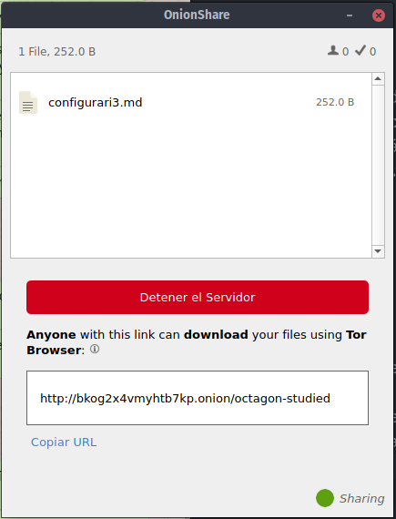

# ¿Cómo compartir archivos de forma segura y anónima?

Muchas veces tenemos la necesidad de enviarle archivos a otrxs personas. Si los enviamos por correo electrónico o usando las herramientas más comunes de chat, dejamos rastros aún si el archivo está cifrado.

## OnionShare

Utilizando las herramientas que nos brinda el proyecto TOR, podemos utilizar [onionshare]() que nos permite enviarle el archivo a otra persona sin que pase por la *nube*. Es decir que siempre estará en tu equipo y la otra persona lo descargará directamente desde allí.

## Paso a paso

1) Ingresá al sitio de [onionshare](https://onionshare.org/) y descargá el software para tu sistema operativo.

2) Una vez descargado deberás instalarlo.
3) Cuando lo abras, verás que lo primero que hace es conectarse a la red TOR.
4) Agregamos el archivo que queremos enviar arrástrandolo desde el **Administrador de archivos** de nuestro sistema operativo o haciendo clic en el botón **Añadir**
5) Una vez que hayamos agregado el o los archivos que querramos enviar, tendremos que hacer clic en el botón verde que aparece debajo para *Encender el servidor*

6) En cuanto las conexiones se hayan realizado, nos aparecerá un enlace (de muchas letras y números) y un botón en rojo para que podamos *Detener el servidor* una vez que no querramos compartir más el archivo. Debajo del *link* tenemos un botón que dice *Copiar URL*, hacemos clic y ya tendremos el enlace listo para compartir.

